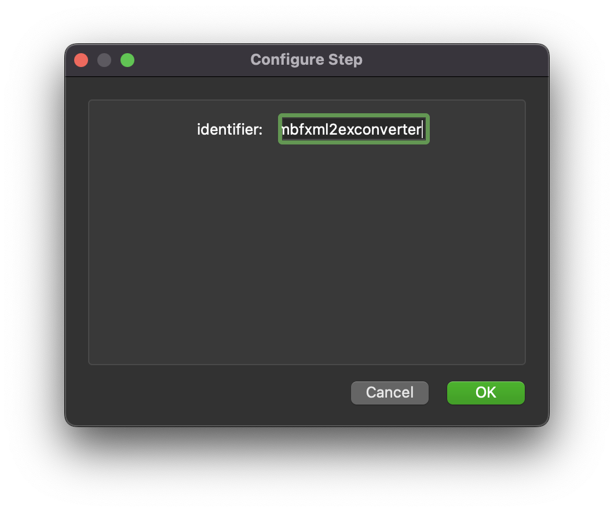

.. _mcp-mbfxml2exconverter-configuration:

Configuration
-------------

This step is used for converting MBF Bioscience XML files to Ex.
This step uses a *http://physiomeproject.org/workflow/1.0/rdf-schema#file_location* which gives the MBF Bioscience XML file to convert and provides a *http://physiomeproject.org/workflow/1.0/rdf-schema#file_location* which is the converted data in Ex format.

.. _fig-mcp-mbf-xml-2-ex-converter-configure-dialog:

   *MBF XML 2 Ex Converter* step configuration dialog.
