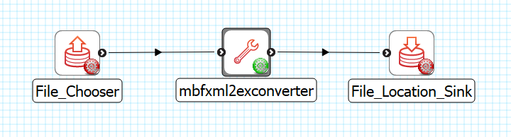

MBF XML 2 Ex Converter
======================

Overview
--------

The **MBF XML 2 Ex Converter** is MAP Client plugin for converting MBF Bioscience XML files to Ex format.

Workflow Connections
--------------------

As shown in :numref:`fig-mcp-MBFXML2Ex-Converter-workflow-connections`, the **MBF XML 2 Ex Converter** need 1 input.

1. The input is the MBF Bioscience XML file that need to be converted into Zinc data file. (Port: *https://opencmiss.org/1.0/rdf-schema#file_location*)

It produces 1 output which may be piped to other workflow steps:

1. A file with the data converted to a Zinc data supplied as a Zinc exf file. (Port: *https://opencmiss.org/1.0/rdf-schema#file_location*)

.. _fig-mcp-MBFXML2Ex-Converter-workflow-connections:

   **MBF XML 2 Ex Converter** workflow connections.

Configure
---------

This step is used for converting MBF Bioscience XML files to Ex.
This step uses a *http://physiomeproject.org/workflow/1.0/rdf-schema#file_location* which gives the MBF Bioscience XML file to convert and provides a *http://physiomeproject.org/workflow/1.0/rdf-schema#file_location* which is the converted data in Ex format.

.. _fig-mcp-mbf-xml-2-ex-converter-configure-dialog:

.. figure:: _images/step-configuration-dialog.png
   :alt: Step configure dialog

   *MBF XML 2 Ex Converter* step configuration dialog.
